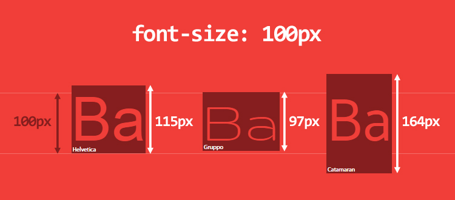

# css深入理解系列之inline formatting context及line-height算法

## 疑问与目的
1. font-siz如何影响行高？
2. 行高的算法？
3. inline replaced元素出现滚动条问题？ 

## 概念
在官方定义[line-height](https://www.w3.org/TR/CSS21/visudet.html#line-height)中，有以下原话
```
10.8 Line height calculations: the 'line-height' and 'vertical-align' properties
As described in the section on inline formatting contexts, user agents flow inline-level boxes into a vertical stack of line boxes. The height of a line box is determined as follows:

The height of each inline-level box in the line box is calculated. For replaced elements, inline-block elements, and inline-table elements, this is the height of their margin box; for inline boxes, this is their 'line-height'. (See "Calculating heights and margins" and the height of inline boxes in "Leading and half-leading".)
The inline-level boxes are aligned vertically according to their 'vertical-align' property. In case they are aligned 'top' or 'bottom', they must be aligned so as to minimize the line box height. If such boxes are tall enough, there are multiple solutions and CSS 2.1 does not define the position of the line box's baseline (i.e., the position of the strut, see below).
The line box height is the distance between the uppermost box top and the lowermost box bottom. (This includes the strut, as explained under 'line-height' below.)
Empty inline elements generate empty inline boxes, but these boxes still have margins, padding, borders and a line height, and thus influence these calculations just like elements with content.

10.8.1 Leading and half-leading
CSS assumes that every font has font metrics that specify a characteristic height above the baseline and a depth below it. In this section we use A to mean that height (for a given font at a given size) and D the depth. We also define AD = A + D, the distance from the top to the bottom. (See the note below for how to find A and D for TrueType and OpenType fonts.) Note that these are metrics of the font as a whole and need not correspond to the ascender and descender of any individual glyph.

User agent must align the glyphs in a non-replaced inline box to each other by their relevant baselines. Then, for each glyph, determine the A and D. Note that glyphs in a single element may come from different fonts and thus need not all have the same A and D. If the inline box contains no glyphs at all, it is considered to contain a strut (an invisible glyph of zero width) with the A and D of the element's first available font.

Still for each glyph, determine the leading L to add, where L = 'line-height' - AD. Half the leading is added above A and the other half below D, giving the glyph and its leading a total height above the baseline of A' = A + L/2 and a total depth of D' = D + L/2.

Note. L may be negative.

The height of the inline box encloses all glyphs and their half-leading on each side and is thus exactly 'line-height'. Boxes of child elements do not influence this height.

Although margins, borders, and padding of non-replaced elements do not enter into the line box calculation, they are still rendered around inline boxes. This means that if the height specified by 'line-height' is less than the content height of contained boxes, backgrounds and colors of padding and borders may "bleed" into adjoining line boxes. User agents should render the boxes in document order. This will cause the borders on subsequent lines to paint over the borders and text of previous lines.
```
事实上，官方并没有定义如何计算行高，但有建议应该根据字体大小。另外，在描述行高算法时，并没有示例说明，难以理解。而在[css-font-metrics-line-height](https://iamvdo.me/en/blog/css-font-metrics-line-height-and-vertical-align)文章中，有提及字体大小相关概念。当采用不同类型字体，虽然font-size大小相同，但行高却是不同，如下图所示。

该文章指出了几点计算行高的情况
1. 在同一行中，字体类型、大小相同，行高等于line-height，如下图所示

2. 在同一行中，字体类型相同、大小不同，由于vertical-align的作用，行高大于line-height，如下图所示

3. 在同一行中，由于父节点与子元素的字体类型不同，将产生一个所谓strut元素，由于vertical-align的作用，行高大于line-height，如下图所示


## 结论
1. 尽量使用line-height: normal，是基于字体类型计算的
2. vertical-align并不可靠
3. 行高的计算受到line-height和vertical-align属性的影响


## 参考
+ https://meyerweb.com/eric/css/inline-format.html
+ https://iamvdo.me/en/blog/css-font-metrics-line-height-and-vertical-align
+ http://christopheraue.net/2014/03/05/vertical-align/#disqus_thread