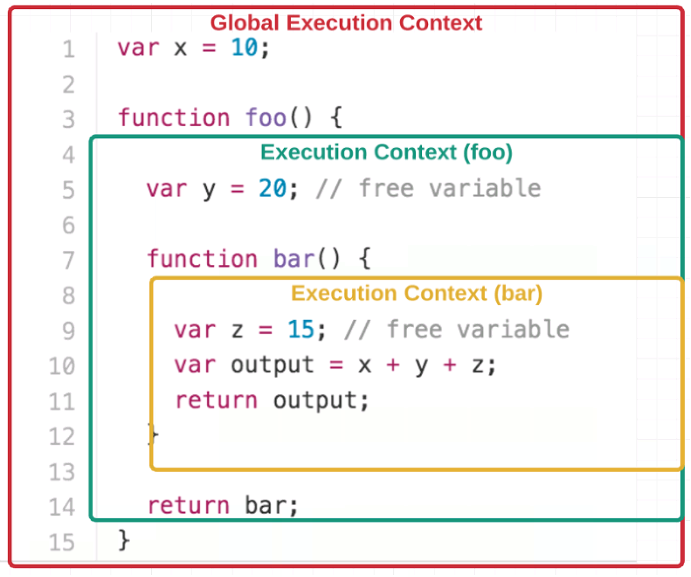
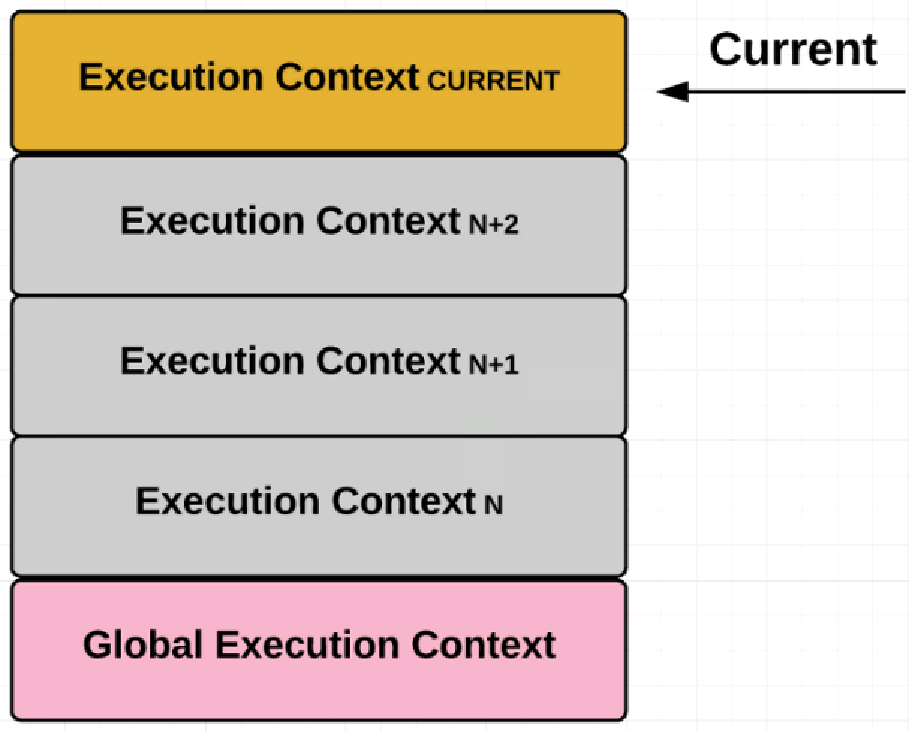

# js深入原理系列之js运行环境标准

## 疑问与目的

1. js运行环境有哪些元素与概念？

## js运行环境标准

承接《浏览器中的js事件原理》，来深入了解js运行环境的原理。从内存分配模型来看，主要是heap、stack；而从执行内容来看，在官方定义[es6.0](https://www.ecma-international.org/ecma-262/6.0/#sec-execution-contexts)中，有以下原话：
```
An execution context is a specification device that is used to track the runtime evaluation of code by an ECMAScript implementation. At any point in time, there is at most one execution context that is actually executing code. This is known as the running execution context. A stack is used to track execution contexts. The running execution context is always the top element of this stack. A new execution context is created whenever control is transferred from the executable code associated with the currently running execution context to executable code that is not associated with that execution context. The newly created execution context is pushed onto the stack and becomes the running execution context.

An execution context contains whatever implementation specific state is necessary to track the execution progress of its associated code. 

code evaluation state:Any state needed to perform, suspend, and resume evaluation of the code associated with this execution context.
Function:If this execution context is evaluating the code of a function object, then the value of this component is that function object. If the context is evaluating the code of a Script or Module, the value is null.
Realm:The Realm from which associated code accesses ECMAScript resources.

Evaluation of code by the running execution context may be suspended at various points defined within this specification. Once the running execution context has been suspended a different execution context may become the running execution context and commence evaluating its code. At some later time a suspended execution context may again become the running execution context and continue evaluating its code at the point where it had previously been suspended. Transition of the running execution context status among execution contexts usually occurs in stack-like last-in/first-out manner. However, some ECMAScript features require non-LIFO transitions of the running execution context.

The value of the Realm component of the running execution context is also called the current Realm. The value of the Function component of the running execution context is also called the active function object.
LexicalEnvironment:Identifies the Lexical Environment used to resolve identifier references made by code within this execution context.
VariableEnvironment:Identifies the Lexical Environment whose EnvironmentRecord holds bindings created by VariableStatements within this execution context.

The LexicalEnvironment and VariableEnvironment components of an execution context are always Lexical Environments. When an execution context is created its LexicalEnvironment and VariableEnvironment components initially have the same value.
Generator:The GeneratorObject that this execution context is evaluating.
```
上述大体描述的是execution context是执行代码环境，有个stack用于保存创建新的execution context。而execution context有code evaluation state、Function、Realm来表示执行代码环境、状态；另外，可能还有LexicalEnvironment、VariableEnvironment、Generator等信息。

在[《Let’s Learn JavaScript Closures》](https://medium.freecodecamp.org/lets-learn-javascript-closures-66feb44f6a44)中，有以下原话：
```
A stack is a Last In First Out (LIFO) data structure, meaning the last thing that you pushed onto the stack is the first thing that gets popped off it. 

Anytime one execution context is replaced by another like this, a new execution context is created and pushed onto the stack, becoming the current execution context.
```



如上述所示，execution context stack是先进后出的数据结构。每个执行代码产生对应的execution context，放入stack中。

在[《Execution Contexts》](http://dmitrysoshnikov.com/ecmascript/chapter-1-execution-contexts/)中，有以下原话：
```
Types of executable code

Global code
var aaa = 1;

Function code
(function foo(flag) {
  if (flag) {
    return;
  }
  foo(true);
})(false);

Eval code
eval('var x = 10');
```
如上述所示，execution context有三种(将来应该不止)执行代码类型：Global code、Function code、Eval code

## 回顾与结论
本文提及了以下几个概念：
1. execution context有code evaluation state、Function、Realm、LexicalEnvironment、VariableEnvironment、Generator
2. 执行代码有三种类型：Global code、Function code、Eval code


## 参考
+ https://www.ecma-international.org/ecma-262/6.0/#sec-execution-contexts
+ https://medium.freecodecamp.org/lets-learn-javascript-closures-66feb44f6a44
+ http://dmitrysoshnikov.com/ecmascript/chapter-1-execution-contexts/