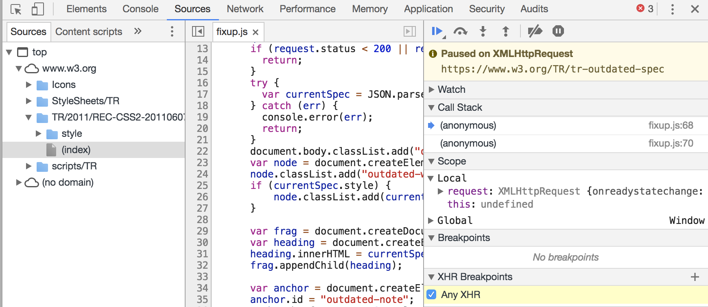

# js深入原理系列之开篇

在工作中经常需要打开浏览器调试工具调试页面，如下图所示，调试工具的中call stack、scope是什么意思？另外，前端经常会涉及闭包、原型链等词汇，那这些又是怎么回事？带着这些疑问，于是就有js深入原理系列文章。

该系列的探索笔记主要是以google国外的blog为主，因此，文章中的参考链接有些是需要翻墙才能打开。

## 目的

通过阅读该系列文章，希望访客你能够掌握以下概念：
1. js的事件模型
2. js的oop实现原理
3. js代码如何运行的
4. js闭包的原理
5. js中this指向的原理
6. ...

## 系列介绍

如果是新手，请先阅读相关基础书籍，推荐阅读文章顺序

-> [《js深入原理系列之浏览器、js的交互》](%%e6%b5%8f%e8%a7%88%e5%99%a8%e3%80%81js%e7%9a%84%e4%ba%a4%e4%ba%92.md) - 先介绍浏览器与js的交互，引出js事件模型。

-> [《js深入原理系列之js运行环境标准》](js%e8%bf%90%e8%a1%8c%e7%8e%af%e5%a2%83%e6%a0%87%e5%87%86.md) - 阐述js事件模型

-> [《JS深入原理系列之js代码执行算法》](js%e4%bb%a3%e7%a0%81%e6%89%a7%e8%a1%8c%e7%ae%97%e6%b3%95.md) 阐述js执行代码中状态、变量的处理算法

-> [《JS深入原理系列之this指向算法》](this%e6%8c%87%e5%90%91%e7%ae%97%e6%b3%95.md) 描述this指向算法

-> [《JS深入原理系列之闭包》](%e9%97%ad%e5%8c%85.md) 阐述闭包的由来，及相关概念

-> [《JS深入原理系列之一切皆对象》](%e4%b8%80%e5%88%87%e7%9a%86%e5%af%b9%e8%b1%a1.md) oop的实现原理

-> [《JS深入原理系列之v8引擎代码探索》](v8%e5%bc%95%e6%93%8e%e4%bb%a3%e7%a0%81%e6%8e%a2%e7%b4%a2.md) 寻找论证文章描述的算法