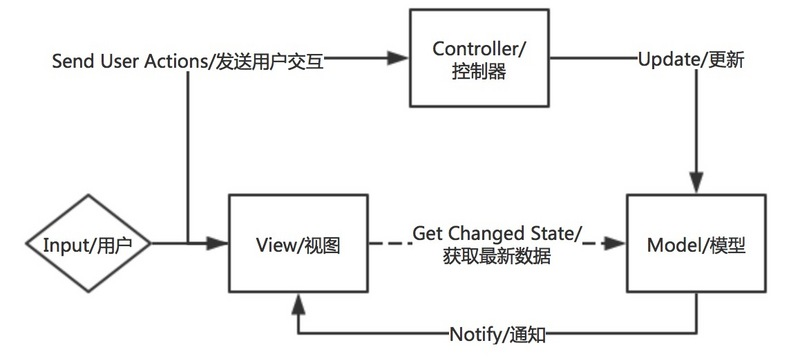

# 结论

一切以盈利为最终目的。产品决定GUI设计哲学，GUI设计哲学决定了前端工程化中的框架。
现代的WEB产品进一步提出以下几点要求:

+ 快速迭代更新产品
+ 高并发请求量下，仍保证软件的可靠性、稳定性
+ 软件易用性、用户体验好等

基于以往的产品需求及上述的进一步需求，各个领域专家提出了自己的设计模式，试图满足产品的需求，但事实上，基于以下几个章节的分析，各个设计模式在不同的应用场景具有各自的优势；这也从另一方面回答了“前端框架选择问题”，应该具体场景具体分析，根据产品的需求选择出最好的技术框架。框架选择的参考点，具体详见《前端工程化问题》《主流框架的选择》里的相关描述。

# *MV*设计理念

MVC模式将有关于渲染、控制与数据存储的概念有机分割，是GUI应用架构模式的一个巨大成就。但是，MVC模式在构建能够长期运行、维护、有效扩展的应用程序时遇到了极大的问题。MVC模式在一些小型项目或者简单的界面上仍旧有极大的可用性，但是在现代富客户端开发中导致职责分割不明确、功能模块重用性、View的组合性较差。作为继任者MVP模式分割了View与Model之间的直接关联，MVP模式中也将更多的ViewLogic转移到Presenter中进行实现，从而保证了View的可测试性。而最年轻的MVVM将ViewLogic与View剥离开来，保证了View的无状态性、可重用性、可组合性以及可测试性。总结而言，*MV*模型都包含了以下几个方面:

+ Models:负责存储领域/业务逻辑相关的数据与构建数据访问层，典型的就是譬如Person、PersonDataProvider。
+ Views:负责将数据渲染展示给用户，并且响应用户输入
+ Controller/Presenter/ViewModel:往往作为Model与View之间的中间人出现，接收View传来的用户事件并且传递给Model，同时利用从Model传来的最新模型控制更新View

##### 经典MVC
MVC模式中典型的用户场景为：

+ 用户交互输入了某些内容
+ Controller将用户输入转化为Model所需要进行的更改
+ Model中的更改结束之后，Controller通知View进行更新以表现出当前Model的状态

根据上述流程，我们可知经典的MVC模式的特性为：

+ View、Controller、Model中皆有ViewLogic的部分实现
+ Controller负责控制View与Model，需要了解View与Model的细节。
+ View需要了解Controller与Model的细节，需要在侦测用户行为之后调用Controller，并且在收到通知后调用Model以获取最新数据
+ Model并不需要了解Controller与View的细节，相对独立的模块

##### 观察者模式的MVC
经典的MVC模式也可以与Observer模式相结合，其典型的用户流程为：

+ 用户交互输入了某些内容
+ Controller将用户输入转化为Model所需要进行的更改
+ View作为Observer会监听Model中的任意更新，一旦有更新事件发出，View会自动触发更新以展示最新的Model状态

可知其与经典的MVC模式区别在于不需要Controller通知View进行更新，而是由Model主动调用View进行更新。这种改变提升了整体效率，简化了Controller的功能，不过也导致了View与Model之间的紧耦合。

##### 典型的MVP
典型的所谓Passive View版本的MVP，其典型的用户场景为：

+ 用户交互输入了某些内容
+ View将用户输入转化为发送给Presenter
+ Presenter控制Model接收需要改变的点
+ Model将更新之后的值返回给Presenter
+ Presenter将更新之后的模型返回给View

根据上述流程，我们可知Passive View版本的MVP模式的特性为：

+ View、Presenter、Model中皆有ViewLogic的部分实现
+ Presenter负责连接View与Model，需要了解View与Model的细节。
+ View需要了解Presenter的细节，将用户输入转化为事件传递给Presenter
+ Model需要了解Presenter的细节，在完成更新之后将最新的模型传递给Presenter
+ View与Model之间相互解耦合

##### MVVM
MVVM模式进一步深化了Presentation Model的思想，利用Data Binding等技术保证了View中不会存储任何的状态或者逻辑操作。在WPF中，UI主要是利用XAML或者XML创建，而这些标记类型的语言是无法存储任何状态的，就像HTML一样（因此JSX语法其实是将View又有状态化了），只是允许UI与某个ViewModel中的类建立映射关系。渲染引擎根据XAML中的声明以及来自于ViewModel的数据最终生成呈现的页面。因为数据绑定的特性，有时候MVVM也会被称作MVB:Model View Binder。总结一下，MVVM利用数据绑定彻底完成了从命令式编程到声明式编程的转化，使得View逐步无状态化。一个典型的MVVM的使用场景为：

+ 用户交互输入
+ View将数据直接传送给ViewModel，ViewModel保存这些状态数据
+ 在有需要的情况下，ViewModel会将数据传送给Model
+ Model在更新完成之后通知ViewModel
+ ViewModel从Model中获取最新的模型，并且更新自己的数据状态
+ View根据最新的ViewModel的数据进行重新渲染

根据上述流程，我们可知MVVM模式的特性为：

+ ViewModel、Model中存在ViewLogic实现，View则不保存任何状态信息
+ View不需要了解ViewModel的实现细节，但是会声明自己所需要的数据类型，并且能够知道如何重新渲染
+ ViewModel不需要了解View的实现细节(非命令式编程)，但是需要根据View声明的数据类型传入对应的数据。ViewModel需要了解Model的实现细节。
+ Model不需要了解View的实现细节，需要了解ViewModel的实现细节

# Unidirectional User Interface Architecture设计理念
Unidirectional User Interface Architecture架构的概念源于后端常见的CROS/Event Sourcing模式，其核心思想即是将应用状态被统一存放在一个或多个的Store中，并且所有的数据更新都是通过可观测的Actions触发，而所有的View都是基于Store中的状态渲染而来。该架构的最大优势在于整个应用中的数据流以单向流动的方式从而使得有用更好地可预测性与可控性，这样可以保证你的应用各个模块之间的松耦合性。与MVVM模式相比，其解决了以下两个问题：

+ 避免了数据在多个ViewModel中的冗余与不一致问题
+ 分割了ViewModel的职责，使得ViewModel变得更加Clean

Facebook强调，双向数据绑定极不利于代码的扩展与维护。

从具体的代码实现角度来看，双向数据绑定会导致更改的不可预期性(UnPredictable)，就好像Angular利用Dirty Checking来进行是否需要重新渲染的检测，这导致了应用的缓慢，简直就是来砸场子的。而在采用了单向数据流之后，整个应用状态会变得可预测(Predictable)，也能很好地了解当状态发生变化时到底会有多少的组件发生变化。另一方面，相对集中地状态管理，也有助于你不同的组件之间进行信息交互或者状态共享，特别是像Redux这种强调Single Store与SIngle State Tree的状态管理模式，能够保证以统一的方式对于应用的状态进行修改，并且Immutable的概念引入使得状态变得可回溯。

譬如Facebook在Flux Overview中举的例子，当我们希望在一个界面上同时展示未读信息列表与未读信息的总数目的时候，对于*MV*就有点恶心了，特别是当这两个组件不在同一个ViewModel/Controller中的时候。一旦我们将某个未读信息标识为已读，会引起控制已读信息、未读信息、未读信息总数目等等一系列模型的更新。特别是很多时候为了方便我们可能在每个ViewModel/Controller都会设置一个数据副本，这会导致依赖连锁更新，最终导致不可预测的结果与性能损耗。而在Flux中这种依赖是反转的，Store接收到更新的Action请求之后对数据进行统一的更新并且通知各个View，而不是依赖于各个独立的ViewModel/Controller所谓的一致性更新。从职责划分的角度来看，除了Store之外的任何模块其实都不知道应该如何处理数据，这就保证了合理的职责分割。这种模式下，当我们创建新项目时，项目复杂度的增长瓶颈也就会更高，不同于传统的View与ViewLogic之间的绑定，控制流被独立处理，当我们添加新的特性，新的数据，新的界面，新的逻辑处理模块时，并不会导致原有模块的复杂度增加，从而使得整个逻辑更加清晰可控。

##### Flux:数据流驱动
lux不能算是绝对的先行者，但是在Unidirectional Architecture中却是最富盛名的一个，也是很多人接触到的第一个Unidirectional Architecture。Flux主要由以下几个部分构成：

+ Stores:存放业务数据和应用状态，一个Flux中可能存在多个Stores
+ View:层次化组合的React组件
+ Actions:用户输入之后触发View发出的事件
+ Dispatcher:负责分发Actions

根据上述流程，我们可知Flux模式的特性为：

+ Dispatcher:Event Bus中设置有一个单例的Dispatcher，很多Flux的变种都移除了Dispatcher依赖。
+ 只有View使用可组合的组件:在Flux中只有React的组件可以进行层次化组合，而Stores与Actions都不可以进行层次化组合。React组件与Flux一般是松耦合的，因此Flux并不是Fractal，Dispatcher与Stores可以被看做Orchestrator。
+ 用户事件响应在渲染时声明:在React的render()函数中，即负责响应用户交互，也负责注册用户事件的处理器

##### Redux:集中式的状态管理
Redux是Flux的所有变种中最为出色的一个，并且也是当前Web领域主流的状态管理工具，其独创的理念与功能深刻影响了GUI应用程序架构中的状态管理的思想。Redux将Flux中单例的Dispatcher替换为了单例的Store，即也是其最大的特性，集中式的状态管理。并且Store的定义也不是从零开始单独定义，而是基于多个Reducer的组合，可以把Reducer看做Store Factory。Redux的重要组成部分包括:

+ Singleton Store:管理应用中的状态，并且提供了一个dispatch(action)函数。
+ Provider:用于监听Store的变化并且连接像React、Angular这样的UI框架
+ Actions:基于用户输入创建的分发给Reducer的事件
+ Reducers:用于响应Actions并且更新全局状态树的纯函数

根据上述流程，我们可知Redux模式的特性为：

+ 以工厂模式组装Stores:Redux允许我以createStore()函数加上一系列组合好的Reducer函数来创建Store实例，还有另一个applyMiddleware()函数可以允许在dispatch()函数执行前后链式调用一系列中间件。
+ Providers:Redux并不特定地需要何种UI框架，可以与Angular、React等等很多UI框架协同工作。Redux并不是Fractal，一般来说Store被视作Orchestrator。
+ User Event处理器即可以选择在渲染函数中声明，也可以在其他地方进行声明。

##### Model-View-Update
又被称作Elm Architecture，上面所讲的Redux就是受到Elm的启发演化而来，因此MVU与Redux之间有很多的相通之处。MVU使用函数式编程语言Elm作为其底层开发语言，因此该架构可以被看做更纯粹的函数式架构。MVU中的基本组成部分有:

+ Model:定义状态数据结构的类型
+ View:纯函数，将状态渲染为界面
+ Actions:以Mailbox的方式传递用户事件的载体
+ Update:用于更新状态的纯函数

根据上述流程，我们可知Elm模式的特性为：

+ 到处可见的层次化组合:Redux只是在View层允许将组件进行层次化组合，而MVU中在Model与Update函数中也允许进行层次化组合，甚至Actions都可以包含内嵌的子Action
+ Elm属于Fractal架构:因为Elm中所有的模块组件都支持层次化组合，即都可以被单独地导出使用

##### Model-View-Intent
MVI是一个基于RxJS的响应式单向数据流架构。MVI也是Cycle.js的首选架构，主要由Observable事件流对象与处理函数组成。其主要的组成部分包括:

+ Intent:Observable提供的将用户事件转化为Action的函数
+ Model:Observable提供的将Action转化为可观测的State的函数
+ View:将状态渲染为用户界面的函数
+ Custom Element:类似于React Component那样的界面组件

根据上述流程，我们可知MVI模式的特性为：

+ 重度依赖于Observables:架构中的每个部分都会被转化为Observable事件流
+ Intent:不同于Flux或者Redux，MVI中的Actions并没有直接传送给Dispatcher或者Store，而是交于正在监听的Model
+ 彻底的响应式，并且只要所有的组件都遵循MVI模式就能保证整体架构的fractal特性

# 参考链接

[GUI应用程序架构的十年变迁:MVC,MVP,MVVM,Unidirectional,Clean](https://segmentfault.com/a/1190000006016817)