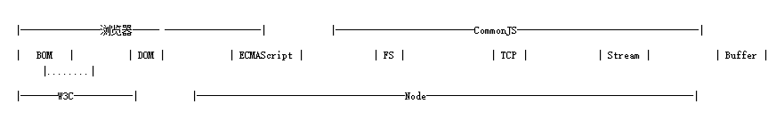
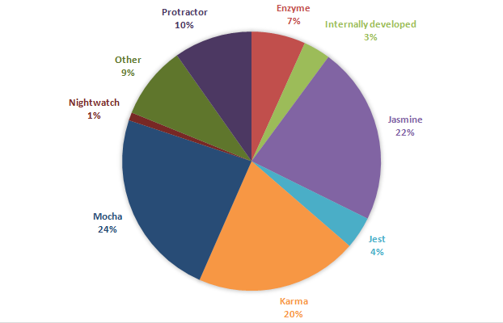

# 为什么要工程化
为什么要工程化？目前所在项目组，在编码开发方面，使用seajs、jquery等组件开发html页面，每当有新的类似的WEB页面，需要copy/paste，再修改细节编码，代码重用率较低；在测试方面，没有引入单元测试\集成测试，导致经常有判空的低级bug出现；在版本发布方面，软件包大小过大、手动修改时间戳等问题。通过上述的问题阐述，如果没有一个优秀的前端工程化解决方案，WEB项目开发将是效率低下、问题多多、性能差的一种状态。

# 工程化的方方面面
前端工程，可以分为开发流程、开发规范两大部分。开发流程可分为开发、测试、发布等重要步骤，开发规范包括编码规范、过程规范等内容。

## 组件、模块化开发

一个公司多个WEB项目，难免有组件重用的情况。而此时，不同项目由不同项目组人负责，传统的方法，是将重用的组件copy一份。对该组件的维护(升级版本、解决bug等)变得冗余、繁琐，因此，组件、模块化开发最主要的是如何解决组件仓库的问题。
组件、模块化开发，分有html模板、CSS样式、JS模块等重要内容。

### html模板引擎
html模板引擎分有前后端引擎，这里只描述前端引擎。目前主要有[baiduTemplate(百度)](http://baidufe.github.io/BaiduTemplate/)\ [artTemplate（腾讯)](https://github.com/aui/artTemplate)\ [juicer（淘宝）](http://juicer.name/)\ [doT](https://github.com/BorisMoore/jquery-tmpl)\ [tmpl](https://github.com/BorisMoore/jquery-tmpl)\ [handlebars](http://handlebarsjs.com/)\ [easyTemplate](https://github.com/qitupstudios/easyTemplate)\ [underscoretemplate](http://documentcloud.github.io/underscore/) \ [mustache](https://github.com/janl/mustache.js) \ [kissytemplate](https://github.com/ktmud/kissy)
在《各种JS模板引擎对比数据》文章中的测试，artTemplate、juicer与doT引擎模板整体性能有绝对优势。另外，angularjs、react有各自的模板引擎。

### CSS模块化
CSS以编程方式，主要分有less、sass、stylus三种。
**LESS**
LESS 并没有裁剪 CSS 原有的特性，更不是用来取代 CSS 的，而是在现有 CSS 语法的基础上，为 CSS 加入程序式语言的特性。
**SASS/SCSS**
sass是最早的css预处理语言，有比less更为强大的功能。sass从第三代开始，放弃了缩进式风格，并且完全向下兼容普通的css代码，这一代的sass被称为scss。
**Stylus**
Stylus 是一个CSS的预处理框架，2010年产生，来自Node.js社区，主要用来给Node项目进行CSS预处理支持，所以 Stylus 是一种新型语言，可以创建健壮的、动态的、富有表现力的CSS。
**结论**

+ 从功能出发，Sass较LESS略强大一些
+ Sass在市面上有一些成熟的框架，比如说Compass，而且有很多框架也在使用Sass，比如说Foundation
+ 就国外讨论的热度来说，Sass绝对优于LESS
+ 就学习教程来说，Sass的教程要优于LESS。在国内LESS集中的教程是LESS中文官网，而Sass的中文教程，慢慢在国内也较为普遍。
+ 个人还是倾向于Stylus，如果你以前使用了Less或Sass会很快的迁移到Stylus上来,教程比较少，推荐一个：http://www.zhangxinxu.com/jq/stylus/
+ Bootstrap4.0已结弃用了less改用Sass了。

### JS模块
[**CommonJs**](http://en.wikipedia.org/wiki/CommonJS)
在es6出来之前，js是没有模块的概念。因此，CommonJs为JS定义了模块的规范。

CommonJS定义的模块分为:{模块引用(require)} {模块定义(exports)} {模块标识(module)}
require()用来引入外部模块；exports对象用于导出当前模块的方法或变量，唯一的导出口；module对象就代表模块本身。

[**AMD**](https://github.com/amdjs/amdjs-api/wiki)
CommonJs制定的标准主要用于node后端，而对于前端，则有了AMD/CMD规范。AMD规范使用了预执行策略，先加载制定依赖，再执行模块代码。

[**CMD**](http://seajs.org/docs/#docs)
CMD规范使用了懒执行策略，当需要加载依赖时，再去下载。[SeaJS与RequireJS的最大异同](https://github.com/seajs/seajs/issues/277)

## 测试
测试是为了保证软件的质量，但根据工作经验来看，前端bug缺陷率的定义是不同，因为并不同于后端。在bug类型上可以是UI设计、编码、易用性、用户体验等类型的bug，因此，前端在bug缺陷率上，应该是各公司不同的定义。
前端测试(研发人员编码的测试)，分有单元测试、集成测试、端到端测试。单元测试、集成测试,顾名思义；端到端测试，指的是测试整个应用，应用的所有配置会设置成和生产环境一样，应用中的一切都会被测试到。
**热门的 JavaScript 自动化单元测试框架**

## 产品发布及优化策略
开发环境与生产环境的代码将是不同的，生产环境的代码一般是开发环境优化后的。项目一般需要考虑版本兼容性、项目性能、过渡升级、版权等问题，因此，需要对开发环境的代码进行一定的处理，才能对外发布。
一般地，WEB项目有以下几个方面需要考虑优化：

+ 加载相关：按需加载、延迟加载、预加载、请求合并
+ 缓存相关：缓存更新、缓存共享、非覆盖式发布

优化方向|优化手段
-|-
请求数量|合并脚本和样式表，CSS Sprites，拆分初始化负载，划分主域
请求带宽|开启GZip，精简JavaScript，移除重复脚本，图像优化
缓存利用|使用CDN，使用外部JavaScript和CSS，添加Expires头，减少DNS查找，配置ETag，使AjaX可缓存
页面结构|将样式表放在顶部，将脚本放在底部，尽早刷新文档的输出
代码校验|避免CSS表达式，避免重定向

# 参考链接
[fouber同学的前端工程化博客](https://github.com/fouber/blog)
[各种JS模板引擎对比数据](http://www.cnblogs.com/guohu/p/3870677.html)
[Less还是Sass,Stylus我们到底选择谁](http://www.511yj.com/css-less-sass.html)
[JS中的模块规范](http://www.cnblogs.com/Leo_wl/p/4067784.html)
[前端开发自动化单元测试趋势](http://www.iteye.com/news/32069)
[测试你的前端代码](http://huziketang.com/blog/posts/detail?postId=58d3dcb87413fc2e8240855a)
[前端工程与性能优化](https://github.com/fouber/blog/issues/3)

