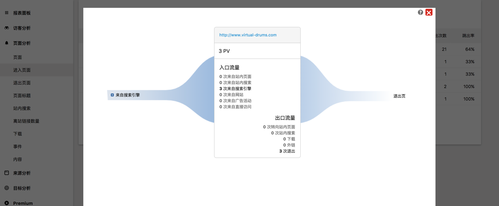

## 用户行为收集
为什么要用户行为收集？
用户行为收集帮助企业有以下几个方面：
+ 用户(访客)分析，了解用户习惯、兴趣
+ 反馈与提升产品设计
+ 产品营销、推广
+ 产品开发与维护
上述的几个方面具体体现在以下几点细节：
    访客分析
        访客基本属性：性别、年龄、学历、职业、地域-(作用：细分营销市场)
        访客浏览了哪些页面-(作用：分析用户兴趣内容)
        访客在某个页面操作了哪些行为-(作用：分析细分访客行为习惯)
        访客访问次数、访问时长访问页面-(作用：访客忠诚度)
        访客的系统环境-(作用：访客主要的系统环境，帮助分清系统优先级)
    产品内容
        访客停留在页面、产品、信息的时间-(作用：页面、产品、信息的欢迎程度)
        访客是否完成页面任务-(作用：页面任务的转化率)
        访客完成页面任务所花费的时间-(作用：页面任务的易用性)
        访客在页面频次高的操作-(作用：页面功能的使用频率)
        访客的页面路径-(作用：反馈产品页面的导航规划)
        页面的退出率-(作用：访客在哪里页面退出)
    营销推广
        访客(流量)来源--(作用：决策投放市场的主力点)

## 目前有哪些主流的用户行为收集方案？
用户行为收集主要有两种方式，一种是前端收集，另一种是后端收集。后端收集并不能完全分析用户的行为，因此，这里主要介绍前端收集方式。
方案选择
前端收集方式，目前免费主流的有谷歌分析、百度分析、Piwik，其中，Piwik是开源项目。以下是这几个产品的简单对比： 
+ 谷歌分析
        网页跟踪
        事件跟踪
        社交互动
        应用跟踪
        用户计时
        异常跟踪
+ 百度分析
        流量分析
        来源分析
        访问分析
        转化分析
        访客分析
        优化分析
+ Matomo (Piwik)
        访客分析
        页面分析
        来源分析
        目标分析
    前两者在数据存储方面是存放在它们公司服务器上，获取原始数据需要调用获取数据接口。后者是开源php应用，可部署在本地。

## 项目需求
提升产品设计
了解用户对产品的关注点
方案结论
经过上述竞品分析对比，结合项目需求，Matomo (Piwik)开源项目即可满足需求，以下几图所示。

综合数据图
 
访客分析图

页面分析图

页面跳转分析图

## Piwik实施
Piwik开源项目的实施可有两种方式，一种是docker部署，一种是Piwik软件安装，由于后者需要有多种安装环境条件，可能过程中出现多种环境问题，因此采取docker方式。
Piwik系统实施
参考https://hub.docker.com/r/library/piwik/，按照以下步骤进行：
1.sudo docker network create lb_web

2.```
git clone https://github.com/indiehosters/piwik.git
cd piwik
MYSQL_ROOT_PASSWORD=mystrongpassword docker-compose up
```

3.修改nginx端口
添加ports：
    - “8001:80”
    - “443:443”

4.打开ip:8001地址，进入引导界面，切换英文页面，填入下列值
Database Server: db
Login: root
Password: mystrongpassword
Database Name: piwik (or you can choose)

5.填写账号
[用户名]:[密码]

6.网站名vue-docs,地址http://ip:port
前端实施
参考https://developer.matomo.org/guides/tracking-javascript-guide
1.记录浏览页面
```
_paq.push(['setDocumentTitle', to.name]);
    _paq.push(['trackPageView']);
```
2.记录页面上用户操作-事件
```
_paq.push(['trackEvent', 'tags', 'viewAllTags']);
```

## 参考链接
+ http://blog.codinglabs.org/articles/how-web-analytics-data-collection-system-work.html
+ http://www.cnblogs.com/naive/p/5245013.html
+ https://github.com/MatteoGabriele/vue-analytics
+ http://www.chinawebanalytics.cn/google-analytics-pros-and-cons/
+ https://tongji.baidu.com/web/welcome/login
+ https://hub.docker.com/r/library/piwik/
+ https://developer.matomo.org/api-reference/tracking-javascript
+ https://developer.matomo.org/guides/tracking-javascript-guide
