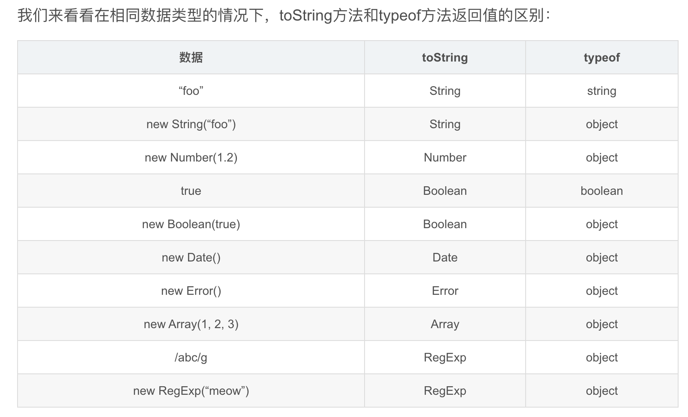
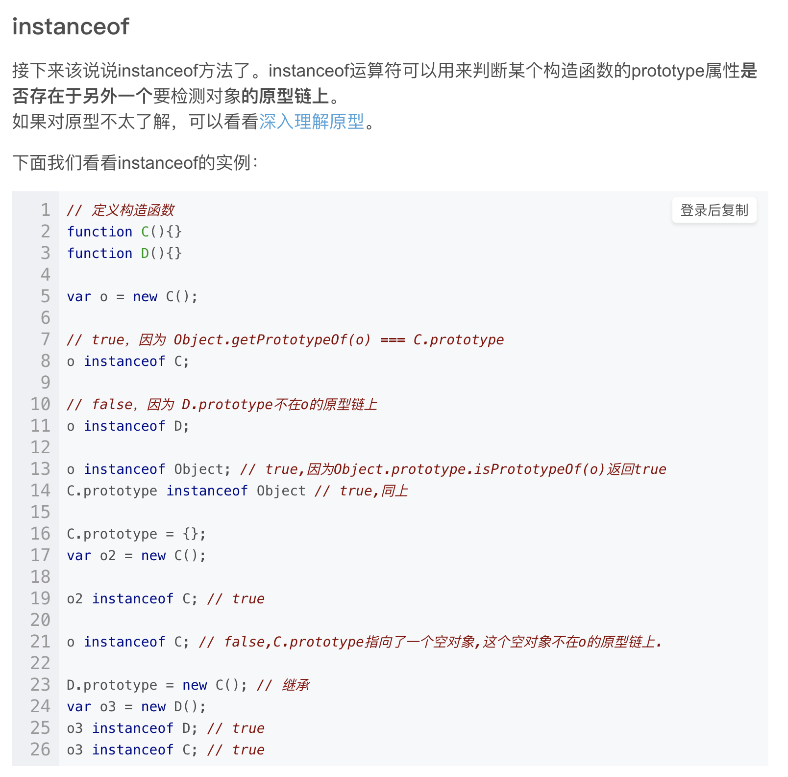
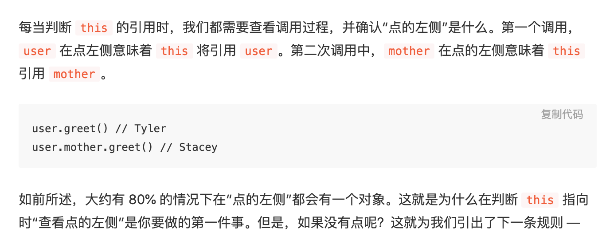
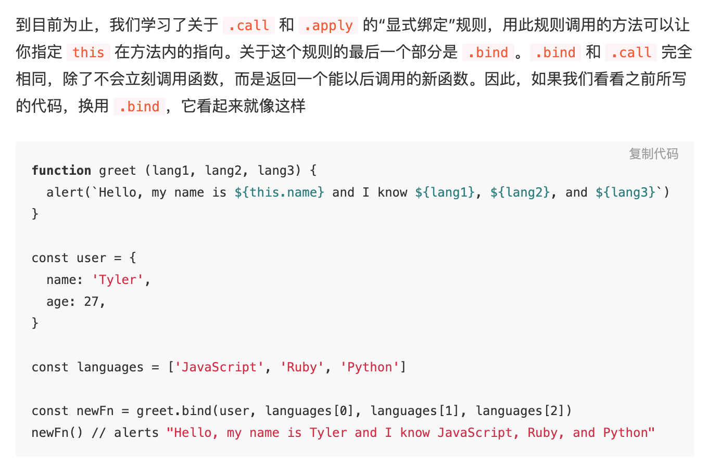
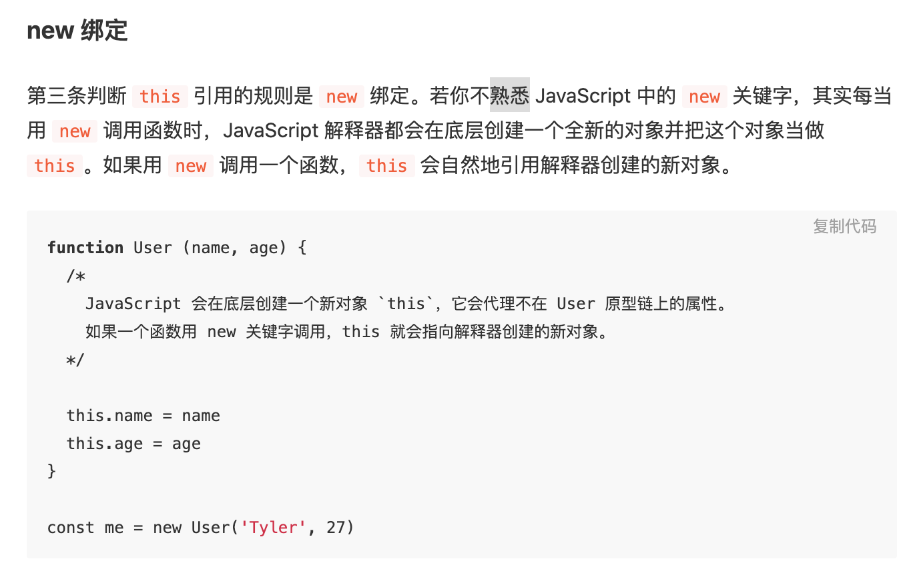
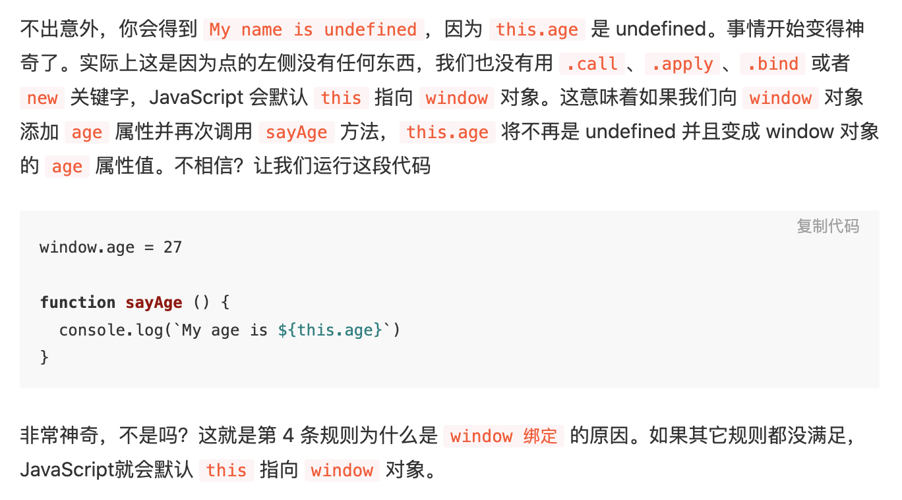

https://github.com/ryanmcdermott/clean-code-javascript

https://github.com/stephentian/33-js-concepts

1. 浮点数的知识
2. If primitives have no properties, why does "abc".length return a value?

//object coerced to primitive 
var Twelve = new Number(12); 
var fifteen = Twelve + 3; 
fifteen; //15
typeof fifteen; //"number" (primitive)
typeof Twelve; //"object"; (still object)

js类型的辨析
原始类型，对象类型的辨析

3. Numbers, booleans, strings, null and undefined are primitive types. All primitive types are passed by value. Objects, arrays, and functions are passed by reference.

变量的赋值，是拷贝一份，还是引用传递。其实都是值传递
https://blog.csdn.net/zzzaquarius/article/details/4902235
https://blog.fundebug.com/2017/08/09/explain_value_reference_in_js/

4. 类型转换
   
   下面的值被转换为 false：
        undefined, null
        Boolean: false
        Number: -0, +0, NaN
        String: ‘’
++[[]][+[]]+[+[]] = '10'
https://juejin.im/post/6844903494051184648

5. typeof
https://blog.csdn.net/mevicky/article/details/50353881

6. this, call, apply 和 bind概念
https://juejin.im/post/6844903680446038023

7. 函数作用域, 块级作用域和词法作用域

8. 闭包

https://developer.mozilla.org/zh-CN/docs/Web/JavaScript/Closures
https://www.cnblogs.com/wangfupeng1988/p/3994065.html

9. 变量提升
https://juejin.im/post/6844903490989342728

10. Promise
https://developer.mozilla.org/zh-CN/docs/Web/JavaScript/Guide/Using_promises

11. 立即执行函数, 模块化, 命名空间

12. 尾递归、尾调用
https://juejin.im/post/6844903590033621006

13. 消息队列与事件循环
https://segmentfault.com/a/1190000014940904#articleHeader7

**宏任务（task）**

浏览器为了能够使得JS内部task与DOM任务能够有序的执行，会在一个task执行结束后，在下一个 task 执行开始前，对页面进行重新渲染 （task->渲染->task->...）
鼠标点击会触发一个事件回调，需要执行一个宏任务，然后解析HTMl。还有下面这个例子，setTimeout

setTimeout的作用是等待给定的时间后为它的回调产生一个新的宏任务。这就是为什么打印‘setTimeout’在‘script end’之后。因为打印‘script end’是第一个宏任务里面的事情，而‘setTimeout’是另一个独立的任务里面打印的。

**微任务**

微任务通常来说就是需要在当前 task 执行结束后立即执行的任务，比如对一系列动作做出反馈，或或者是需要异步的执行任务而又不需要分配一个新的 task，这样便可以减小一点性能的开销。只要执行栈中没有其他的js代码正在执行且每个宏任务执行完，微任务队列会立即执行。如果在微任务执行期间微任务队列加入了新的微任务，会将新的微任务加入队列尾部，之后也会被执行。微任务包括了mutation observe的回调还有接下来的例子promise的回调。

一旦一个pormise有了结果，或者早已有了结果（有了结果是指这个promise到了fulfilled或rejected状态），他就会为它的回调产生一个微任务，这就保证了回调异步的执行即使这个promise早已有了结果。所以对一个已经有了结果的promise调用.then(yey, nay)会立即产生一个微任务。这就是为什么‘promise1’,'promise2'会打印在‘script end’之后，因为所有微任务执行的时候，当前执行栈的代码必须已经执行完毕。‘promise1’,'promise2'会打印在‘setTimeout’之前是因为所有微任务总会在下一个宏任务之前全部执行完毕。

